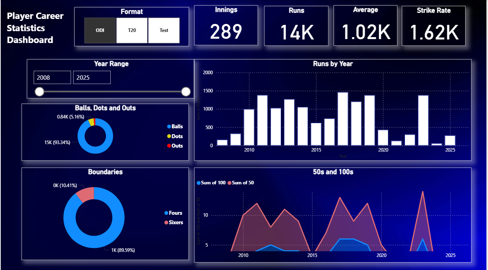
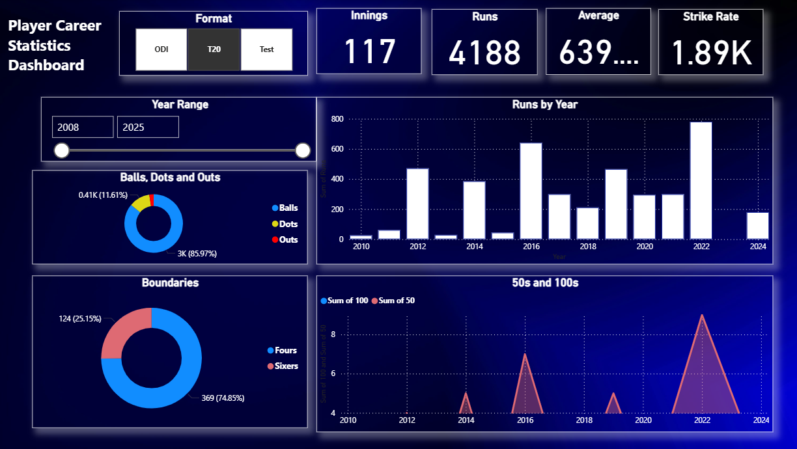
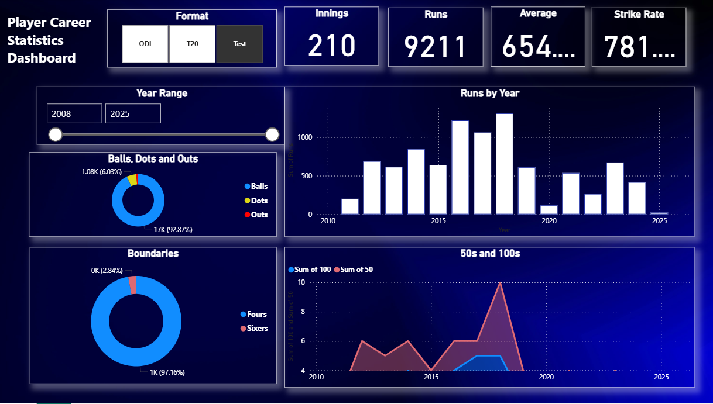

# Cricketer Career Stats Dashboard - Power BI
This is my practice dashboard on Power BI of a cricketer career statistics analysis. 

This Power BI dashboard visualizes the career statistics of a cricketer. It helps explore performance trends over time using intuitive visuals like donut charts, bar graphs, and slicers.

## 📊 Dashboard Highlights
- Total innings,runs,average and strike rate over certain years with individual formats (ODI, TEST, T20).
- Runs scored per year.
- 50s and 100s over years.
- Count of dot balls, outs (donut chart).
- Boundaries (donut chart).

## 🛠 Tools Used
- **Excel** for cleaning and organizing raw data.
- **Power BI** for dashboard development.

## 📸 Preview
**ODI Dashboard Screenshot**

**T20 Dashboard Screenshot**

**TEST Dashboard Screenshot**

